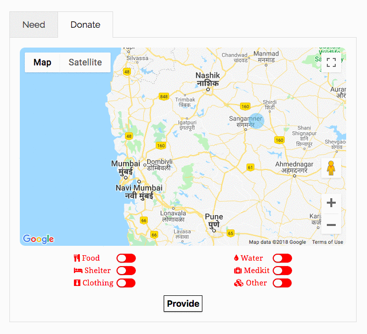

<p align="center">
  <a href="" rel="noopener">
 </a>
</p>

<h3 align="center">Digital Citizen Guidance</h3>

<div align="center">

[](https://www.python.org/)
<br>
[](http://hits.dwyl.io/inishchith/digital)

</div>

---

> `Add Description Here`

<div align="center">
&#10077; Humko Bachai Lo Babua &#10078;  -  <a href ="https://github.com/shivam1708"> cheetAh </a>
</div>

---

### Features

- F1
- F2

<div align="center">

<h3 > Web-App  </h3>
<br>
<p align="center">

</p>

<h3> On SMS App  </h3>
<br>


</div>

---

### Installation

- Install dependencies

```sh
        $ pip3 install -r requirements.txt
```

- Edit [config.py](https://github.com/inishchith/digital/blob/master/App/config.py)

---

### Note

- This repository / project was a part of **TSEC Hackathon 2018**, was done under `24 hours with minimal pre-preparation`

---

### Contributors

- [@shivam1708](https://github.com/nurdtechie98)
- [@nurdtechie98](https://github.com/shivam1708)
- [@freelancer-98](https://github.com/Freelancer-98)
- [@inishchith](https://github.com/inishchith)
